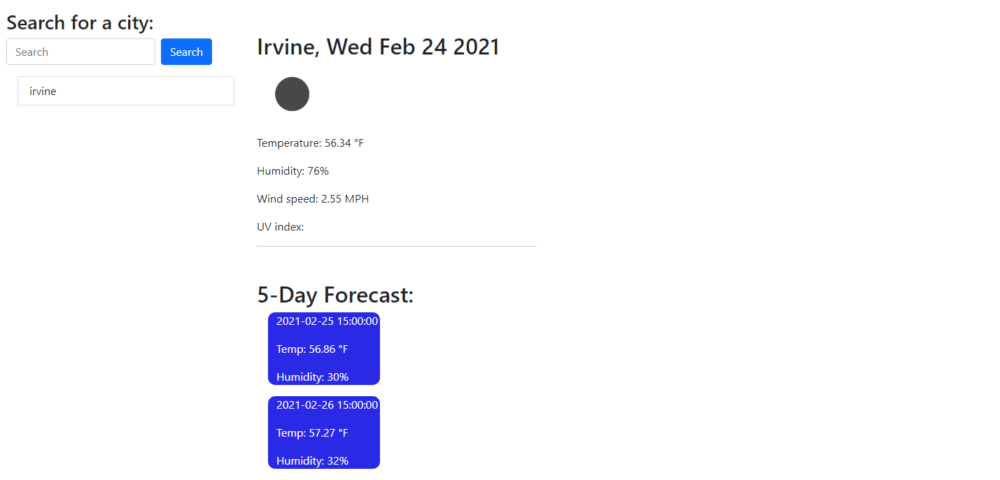

# Weather-Dashboard

This is a simple weather forecaster. First you type in the city you would like to get the weather for. When you click search you will see the weather for the current day and below will be the weather for the next 5 days. On the left will populate previous cities that have been searched. If you click on a previous city it will repopulate with the weather. 

https://ohskie3.github.io/Weather-Dashboard/

